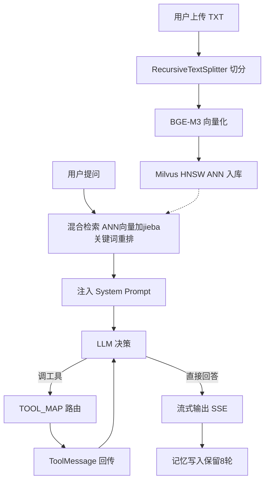

# RAG 知识库问答 Agent

上传文档 → 自动切分 → 向量化 → 多轮对话问答，支持工具调用和流式输出。

## 功能
- 上传 TXT → 自动切分 → BGE-M3 向量化 → Milvus HNSW 入库
- 混合检索（ANN 向量 + jieba 关键词）
- Function Calling：计算器 / 天气 / 时钟
- 三模型切换：DeepSeek / 千问 / Ollama 本地
- 流式输出 SSE + 多轮记忆 8 轮

## 技术栈
Python · LangChain · Milvus · Ollama BGE-M3 · Streamlit · FastAPI · Docker

## 架构
用户提问 → RAG 检索 → 注入 System Prompt → LLM → 直接答 / 调工具 → 回传 → 输出

## 启动
pip install -r requirements.txt
streamlit run app.py
